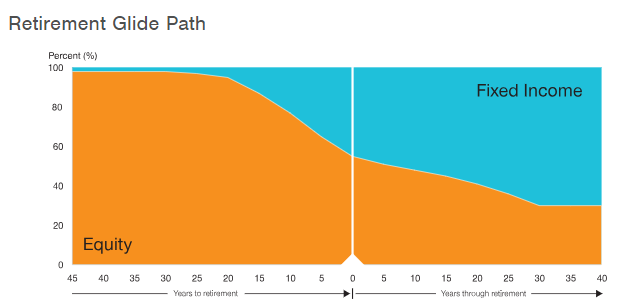
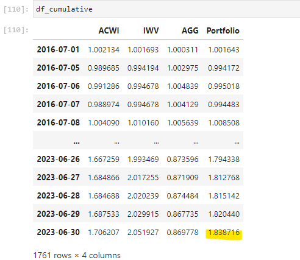

# TargetGate

TargetGate is attempting to compare Target Date Mutual Funds to a customized glide path allocation built by us. We will attempt multiple allocation strategies to outperform various Target Date funds.

Tools:
Alpaca
Python
Jupyter Lab
Plotting Tools

Target Date Definition:
Target-date funds are structured to maximize the investor's returns by a specific date. Generally, the funds are designed to build gains in the early years by focusing on riskier growth stocks, then they aim to retain those gains by weighting towards safer, more conservative choices as the target date approaches.

Largest Target Date Providers by AUM

  

## Base Target Fund used for Analysis

 

## Indices used for Customized Target Date Fund

## 
