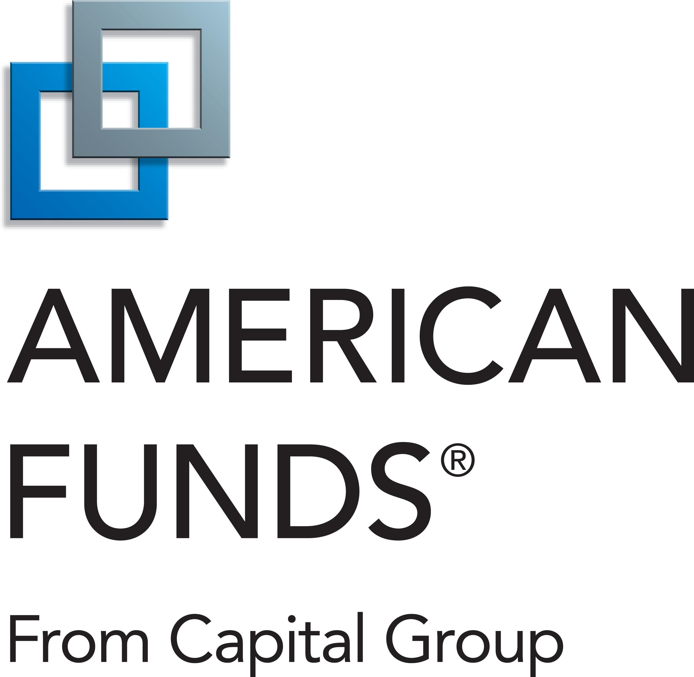

# TargetGate?

TargetGate is attempting to compare Target Date Mutual Funds to a customized allocation built by us - the dream team. 

Tools: 
Alpaca 
Python 
Jupyter Lab 
Plotting Tools 

# <ins>Target Date Definition:</ins> 
Target-date funds are structured to maximize the investor's returns by a specific date. Generally, the funds are designed to build gains in the early years by focusing on riskier growth stocks, then they aim to retain those gains by weighting towards safer, more conservative choices as the target date approaches.

While target date funds (TDF) are structured as mutual funds designed to manage investment risk, they can be more complex. Individual investors usually pick a fund with a target year closest to the year you anticipate retiring, say a "2050 Fund." The closer a fund gets to its target date, the more it focuses on assets with a lower risk profile, such as fixed income, cash, and cash equivalents. This shift across lower-risk asset classes is called a "glide path." A fund's glide path is designed to reduce investment risk over time—but glide paths can vary considerably from fund to fund. 

# <ins>Critical Considerations of Target Date Funds:</ins>  
As with other mutual funds, fees are vital as a slight difference in fees (measured in percentages) can add up to a significant dollar difference in the returns.  

It is also essential to look at one's overall investment portfolio. An outsized investment holding in either stocks or bonds can magnify or offset the impact of your target fund returns.  

More critically, the nature of these funds is more of a "set it and forget it" mechanism, with investors contributing their money regularly (usually on a paycheck basis) over time. Unfortunately, the allocations may not account for market events or economic concerns. Over time, from entering the corporate world to when they retire or experience several life event, they may not consider your risk tolerance. Monitoring any TDF's performance is crucial to ensure that it meets one's investment risk tolerance over time.  

Lastly, while it is possible to invest in a target date fund outside of a tax-advantaged retirement vehicle such as an IRA or 401(k), investors must be aware of the taxation repercussions of their investment. More specifically, these funds generate taxable income such as interest, dividends, and capital gains that lower overall returns.  

Given all the advantages of TDFs, there are pitfalls that investors should be aware when the fiduciary breaches its duties.  Case in point: In or around June 2021, Northern Trust was hit with an ERISA class-action suit for loading its retirement plan with poorly performing proprietary target date funds that underperformed similarly available offerings in the market. It was said to have breached its fiduciary duty to select and monitor the plan’s investment options prudently. A lawsuit filed by its current and former employers stated that it failed to monitor plan investments regularly and remove or replace ones that had become imprudent over time.  As a result, Northern Trust Focus Funds performed worse than 70-90% of their peer funds for nearly an entire decade, a period during which investors were not given any alternate choices.

# <ins>Largest Target Date Providers by AUM</ins>

  &nbsp;&nbsp;&nbsp;  

## Analysis

   

  

Per the above Target Date Fund risk-reward chart, we can infer longer term Sharpe ratios of target date funds are approximately 1. We decided to attempt to beat this risk-adjusted return profile.

  

  

  

  

The US tilted portfolio consisted of 70% US Equitites, 20% Global Equities, and 10% bonds. It achieved annualized returns of 9% per year, outperforming typical returns of Target Date Funds. However, on a risk-adjusted basis, the portfolio Sharpe Ratio of 0.6 is less efficient per unit of risk than a TDF.

  

The bond tilted portfolio consisted of 10% US Equitites, 10% Global Equities, and 80% bonds. It achieved annualized returns of only 0.5% per year and rate volatility has made bonds extremely unattractive.

  
  

Reviewing our Global Equity tilted portfolio (20-70-10, US Equity-Global Equity-Bonds) and our Balanced asset class mix (40-40-20, US Equity-Global Equity-Bonds), we see returns perfomred in line with TDFs and suffered from less efficient Sharpe Ratios.

  

We decided to run another iteration equally weighted between three high performing stocks (NVDA, TSLA, and AAPL). Even with annualized returns of over 30%, a Sharpe Ratio of just 0.87 was achieved due to the volatility. 

Iterating through these portfolios gave us an interesting perspective about how TDFs can be useful in optimizing risk-reward over long periods of time which can be of benefit, especially in periods of economic stress, 
despite valid criticisms.

## Indices used for Customized Target Date Fund

<ins>ISHARES MSCI ACWI ETF</ins>  
  
<ins>ISHARES RUSSELL 3000 ETF</ins>  
  
<ins>ISHARES CORE US AGGREGATE BOND ETF</ins>  
  

## 
